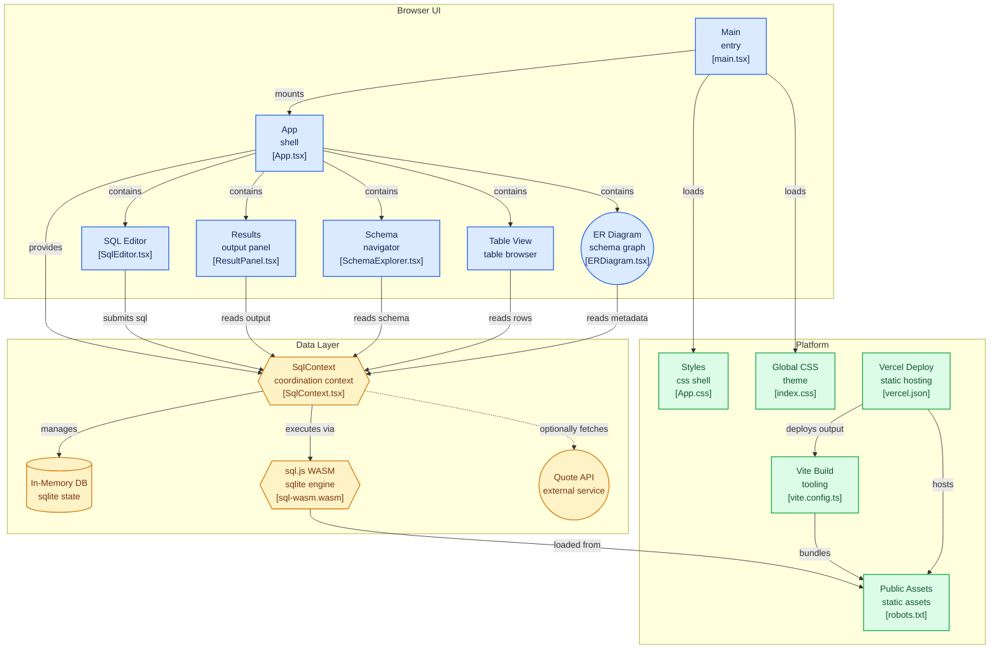

# SQLide : Professional SQL Workbench IDE

SQLide is a high-performance, aesthetically premium web-based SQL IDE built for speed and privacy.


Execute complex queries,
visualize ER diagrams,
and manage your schemas entirely in the browser with zero latency.
website live [here](https://sqlide.is-a.dev)

[website demo.webm](https://github.com/user-attachments/assets/023cdd55-0378-422b-be7a-c4d4b1089215)


## Features

- **Local-First Execution**: Powered by `sql.js` (SQLite WASM) for near-instant execution using your browser's RAM. (no database storin, 100 percent secure)
- **Interactive ER Diagrams**: Automatically visualize table relationships with Foreign Key detection and dashed connection lines.
- **Pro Editor**: Integrated Monaco Editor (VS Code engine) with SQL autocomplete, font sizing, and word wrap.
- **Data Portability**: Import/Export your databases as `.sqlite` files. Export query results to CSV or JSON.
- **Smart Schema Explorer**: Browse tables, views, and columns with a single click.
- **Modern Aesthetic**: Deep dark mode with glassmorphism effects and responsive layout.
- **Kanye West Inspiration**: Every new session starts with a random quote from the Kanye REST API. (yes its a feature :)


## Tech Stack

- **Core**: React + TypeScript + Vite
- **Database Engine**: [sql.js](https://github.com/sql-js/sql.js) (SQLite WebAssembly)
- **Editor**: [Monaco Editor](https://microsoft.github.io/monaco-editor/)
- **Icons**: Lucide React + Custom SVGs
- **Styling**: Vanilla CSS with Design Tokens

## Getting Started

1. **Install dependencies**:
   ```bash
   npm install
   ```
2. **Run locally**:
   ```bash
   npm run dev
   ```
3. **Build for production**:
   ```bash
   npm run build
   ```

## License

This project is licensed under the PolyForm Noncommercial License 1.0.0 - see the [LICENSE](LICENSE) file for details.

---
Built by [park-bit](https://github.com/park-bit); [support me?](https://www.chai4.me/park-bit); [website-link](https://sqlide.is-a.dev)
